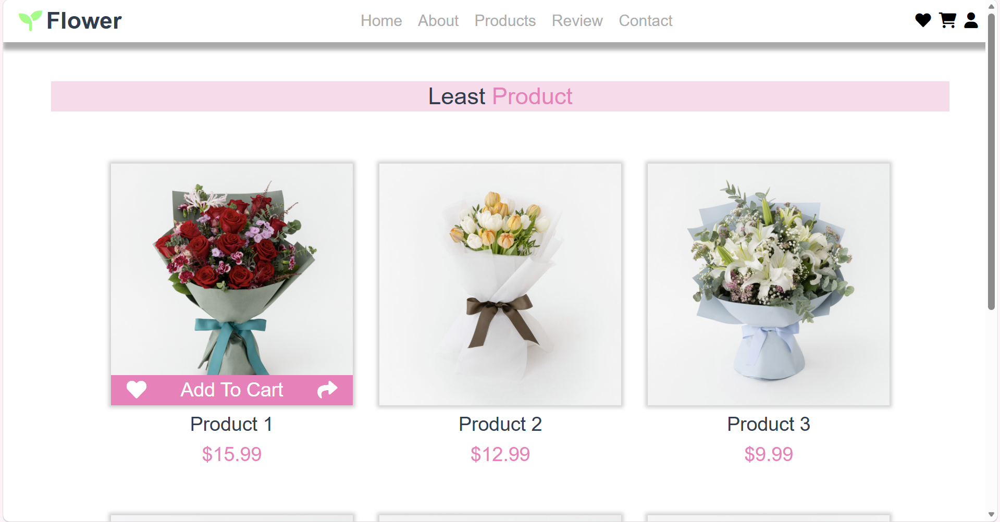

# 🌼 Flower Shop

一個具備「完整購物流程 × 使用者系統 × 後台管理 × 銷售分析」的花店電商平台，</br>
模擬實際電商網站運作流程，並提供管理者進行商品與數據分析的功能。



## 專案特色
- 模擬完整電商流程（瀏覽 → 收藏 → 購物 → 回饋）
- 建立後台管理系統（商品 / 留言 / 客服）
- 提供 銷售數據分析與視覺化
- 前後端分離架構
- 強調使用者與管理者雙視角設計

## 專案動機

本專案旨在模擬真實電商平台的運作模式，</br>
不僅提供使用者完整的購物體驗，也建立後台系統讓管理者能夠：

- 管理商品
- 追蹤使用者互動
- 分析銷售數據

透過前後台整合，提升對系統設計與資料流的理解。


## 核心功能

### 前台（User Side）

#### 使用者系統
- 使用者註冊 / 登入
- Navbar 依登入狀態動態切換
- 使用者中心（個人資料修改）

#### 商品互動
- 商品瀏覽
- Like 收藏功能
- 購物車系統

#### 使用者互動
- 網站回饋（留言）
- 客服中心聯絡功能
- 操作即時回饋（成功 / 失敗提示）

### 後台管理系統（Admin Panel）

#### 交易管理
- 顧客商品購買紀錄

#### 使用者互動監控
- 網站留言管理
- 客服聯絡紀錄查詢

#### 銷售數據分析
- 各產品銷售數量統計
- 商品評論分數分佈
- 每月收益折線圖分析


## 技術架構

### Frontend
- Vue 3
- Vue Router
- Chart.js

### Backend
- Flask
- SQLAlchemy

### Dev Tools
- concurrently（同時啟動前後端）


## 安裝與執行

### 1. Clone 專案
```bash
git clone https://github.com/Clare0808/flower-shop.git
cd flower-shop
```

### 2. 安裝套件

```bash
npm install
```

### 3. 環境需求

- Node.js
- npm
- Python
- SQLAlchemy

### 5. 啟動專案

```bash
npm run dev
```

若要分開啟動 (選擇性) :

#### 前端

```bash
npm run serve
```

#### 後端
```bash
cd backend
python app.py
```
